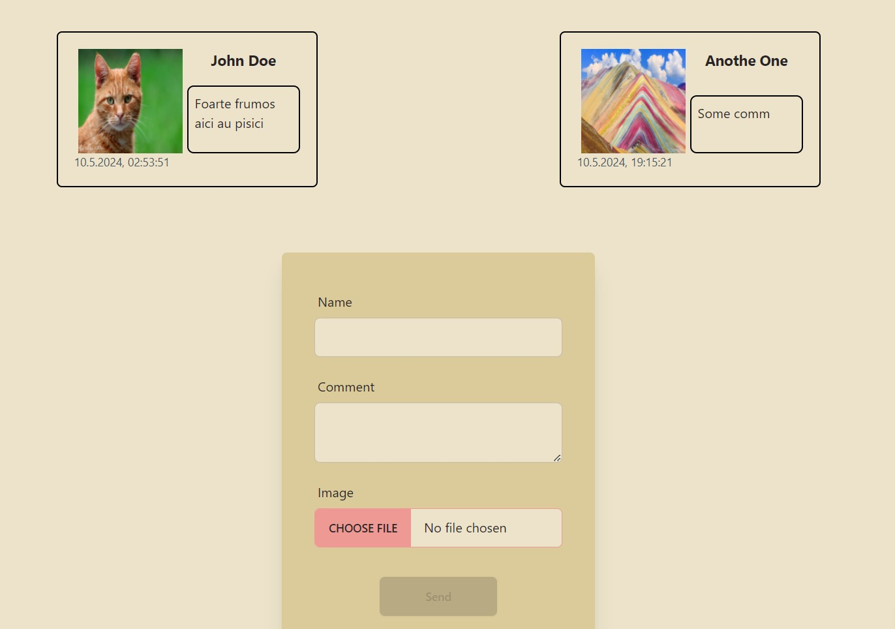

# A review book where clients can leave reviews of the visited place

### A sveltekit client that lets users add their own reviews and view previous reviews

## _./review-book_



## An API used for storing and retrieving reviews

### _./api_

The reviews are stored in an Azure Table Storage to hold the actual data of the review

```json
{
"author": "string",
"comment": "string",
"imageUrl": "string",
"thumbnailUrl": "string"
}
```

The `imageUrl` and `thumbnailUrl` are generated automatically when they are saved in an Azure Blob Storage and will contain the url of the blob.

`ThumbnailUrl` is obtained after an Azure Function that triggers when the blob is created finishes creating the modified thumbnail image, the API checks an Azure Queue Storage for incoming messages and updates the review with the `thumbnailUrl` parameter.

| ENDPOINT |                 Method                 |                 Result                 |
| :------: | :------------------------------------: | :------------------------------------: |
| /reviews |  <span style="color:green">GET</span>  | Returns a list of all existing reviews |
| /reviews | <span style="color:orange">POST</span> |     Creates and saves a new review     |

## An Azure worker function that creates an image of reduced size to be better rendered

### _./worker_
